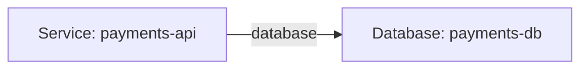
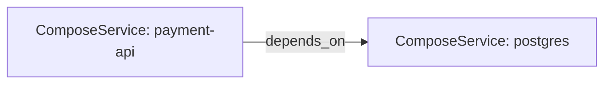

# Recursive YAML Repository Topology Mapper

## Goal

Map an entire repository containing `.yaml` / `.yml` files recursively and generate **one Markdown file with an embedded MermaidJS topology diagram**.

The tooling is designed for restricted Windows workstations and avoids requiring:

- administrator rights
- Go
- Graphviz
- `pygraphviz`
- Docker
- native C/C++ compilation
- system-wide Python packages

The only Python dependency is **PyYAML**, installed into a local `.venv` next to the scripts.

## Files

- `yaml-topology.py` — recursive YAML scanner, relationship mapper, Mermaid renderer, and Markdown generator.
- `run-topology.ps1` — non-admin PowerShell wrapper that creates a local virtual environment and runs the CLI.
- `TOOLING.md` — these instructions.

## What the command does

```text
Repository folder
      |
      +-- **/*.yaml
      +-- **/*.yml
              |
              v
       Recursive scanner
              |
              v
         PyYAML parser
              |
       +------+------+ 
       |             |
    resources     references
       |             |
       +------v------+ 
              |
       topology graph
              |
              v
        Mermaid syntax
              |
              v
        topology.md
```

The generated Markdown contains a fenced MermaidJS block:

````markdown
# YAML Repository Topology

## Topology


````

GitHub and Mermaid-capable Markdown viewers can render that diagram directly.

## Quick start — PowerShell

Use a normal, non-elevated PowerShell window.

```powershell
cd D:\code\projects\database-monolith-migration-tools\tools\yaml-topology

Set-ExecutionPolicy -Scope Process Bypass

.\run-topology.ps1 `
  -Repo "D:\path\to\my-infrastructure-repo" `
  -Output "D:\path\to\my-infrastructure-repo\topology.md"
```

`Set-ExecutionPolicy -Scope Process Bypass` applies only to the current PowerShell process. It does not change machine-wide policy and normally does not require administrator rights.

### Simplest usage from this kit root

```powershell
cd D:\code\projects\database-monolith-migration-tools

.\tools\yaml-topology\run-topology.ps1 -Repo .\manifests -Output .\tools\yaml-topology\out\manifests-topology.md
```

The command recursively scans the folder supplied with `-Repo` and writes one Markdown topology document.

## CLI usage without the PowerShell wrapper

Create a local virtual environment:

```powershell
python -m venv .venv
```

Install PyYAML into that environment only:

```powershell
.\.venv\Scripts\python.exe -m pip install pyyaml
```

Generate Markdown:

```powershell
.\.venv\Scripts\python.exe .\yaml-topology.py `
  "D:\path\to\my-infrastructure-repo" `
  --output "D:\path\to\my-infrastructure-repo\topology.md"
```

Or from a repository root:

```powershell
python D:\code\projects\database-monolith-migration-tools\tools\yaml-topology\yaml-topology.py . -o topology.md
```

## Mermaid direction

Default direction is left-to-right:

```powershell
.\run-topology.ps1 -Repo . -Output topology.md -Direction LR
```

Available directions:

```text
LR  left -> right
RL  right -> left
TB  top -> bottom
BT  bottom -> top
```

Example for a top-to-bottom infrastructure diagram:

```powershell
.\run-topology.ps1 `
  -Repo . `
  -Output topology.md `
  -Direction TB
```

## Custom Markdown title

```powershell
.\run-topology.ps1 `
  -Repo . `
  -Output infrastructure-topology.md `
  -Title "Infrastructure Repository Topology"
```

## Raw Mermaid output

The CLI remains backwards compatible with `.mmd` files. When the output extension is `.mmd`, `--format auto` writes raw Mermaid instead of Markdown:

```powershell
python .\yaml-topology.py . -o topology.mmd
```

You can also explicitly choose the format:

```powershell
python .\yaml-topology.py . -o topology.md --format markdown
python .\yaml-topology.py . -o topology.mmd --format mermaid
```

The PowerShell wrapper intentionally generates Markdown.

## What is scanned

The mapper recursively discovers:

```text
*.yaml
*.yml
```

Common generated/vendor directories are skipped:

```text
.git
.venv
venv
node_modules
bin
obj
.terraform
```

Multi-document YAML separated by `---` is supported.

## Relationship discovery

The mapper uses **schema-aware adapters** first, then a **generic heuristic** pass.

### Adapters (deterministic)

| Adapter | Detected when | Links extracted |
|---------|---------------|-----------------|
| `compose` | `services:` + image/build/depends_on | `depends_on`, `links`, networks, volumes |
| `kubernetes` | `kind` + `apiVersion` / `metadata` | ownerReferences, ConfigMap/Secret refs, volume mounts |
| `github-actions` | `jobs` + `on` / `.github/workflows/` | `needs`, workflow/job `uses` |
| `azure-devops` | stages/jobs + trigger/pool / `azure-pipelines.yml` | stage/job `dependsOn` |
| `cloudformation` | `Resources` + `Type` / template version | `DependsOn`, `Ref`, `Fn::GetAtt` |
| `kit-manifest` | domain/wave ownership YAML | domain↔wave, DBs, services, SQL projects, EF tables |
| `generic` | everything else | identity + reference keys, structured depends lists |

Enable a subset:

```powershell
.\run-topology.ps1 -Repo . -Output topology.md -Adapters "compose,kubernetes,generic"
```

Omit unresolved stub nodes:

```powershell
.\run-topology.ps1 -Repo . -Output topology.md -NoStubs
```

### Generic identity / reference keys

Identity candidates include:

```text
name
id
service
app
application
component
domain
wave
```

Reference candidates include:

```text
dependsOn / depends_on / dependencies / needs
ref / reference / target
service / database / queue / topic / cluster / host / endpoint
backend / upstream / uses / image
source_database / target_database / target_service / owner_team / domain
```

Exact name matches are preferred. Unresolved targets become dashed stub nodes so the dependency link remains visible.

Treat the generated topology as a **repository discovery map**, not authoritative runtime/deployment state.

## Generated Markdown

The Markdown contains:

1. document title
2. scanned repository path
3. counts of YAML files, nodes (including stubs), dependency links, and unresolved refs
4. a MermaidJS `flowchart` (stubs use a dashed style)
5. a **Dependencies** table (`From | Relation | To`)
6. notes on adapters vs heuristics

Example:

````markdown
# Infrastructure Repository Topology

Generated from `C:\git\platform-infra`.

## Summary

- YAML files scanned: **124**
- Topology nodes: **89** (stubs: **6**)
- Dependency links: **73**
- Unresolved references before stubbing: **6**

## Topology



## Dependencies

| From | Relation | To |
|------|----------|----|
| ComposeService: payment-api | `depends_on` | ComposeService: postgres |
````

## Viewing the result

### GitHub

Commit or push `topology.md` and open it on GitHub. Mermaid fenced code blocks are rendered as diagrams by GitHub's Markdown renderer.

### VS Code

Open `topology.md` using a Markdown preview that supports Mermaid. No viewer is required for generating the file itself.

### Plain text

Even without Mermaid rendering, the Markdown remains readable and the complete graph definition is visible as text.

## Useful inventory command

Before mapping, inspect the YAML footprint using only PowerShell:

```powershell
Get-ChildItem . -Recurse -File -Include *.yaml,*.yml |
  Where-Object { $_.FullName -notmatch '\\.git\\|\\node_modules\\|\\bin\\|\\obj\\' } |
  Select-Object FullName
```

Count files:

```powershell
(Get-ChildItem . -Recurse -File -Include *.yaml,*.yml).Count
```

## No-admin design

The wrapper creates:

```text
tools/yaml-topology/
  .venv/
  yaml-topology.py
  run-topology.ps1
  TOOLING.md
  README.md
```

Everything stays under the current user's writable directory. Nothing needs to be installed under `Program Files`, no Windows service is created, and no machine environment variables are changed.

If your organization blocks PowerShell script execution entirely, invoke Python directly instead of changing any execution policy:

```powershell
python -m venv .venv
.\.venv\Scripts\python.exe -m pip install pyyaml
.\.venv\Scripts\python.exe .\yaml-topology.py D:\path\to\repo -o D:\path\to\repo\topology.md
```

## Security and repository safety

The mapper:

- only reads YAML files
- uses `yaml.safe_load_all`
- does not execute YAML contents
- does not execute deployment commands
- does not connect to Kubernetes/cloud APIs
- does not require cloud credentials
- does not modify source YAML
- only writes the requested topology output

For sensitive repositories, inspect the generated Markdown before sharing it. Infrastructure identifiers such as service names, hostnames, endpoints, databases, queues, clusters, and internal component names may be present in the diagram.

## Adapter coverage

Implemented schema-aware adapters:

```text
Kubernetes (core refs)
Docker Compose
Azure DevOps pipelines
GitHub Actions
AWS CloudFormation
kit domain / migration-wave manifests
generic heuristic fallback
```

Still useful future extensions: Helm chart values wiring, Argo CD / Flux source→app edges, Azure deployment YAML beyond DevOps pipelines.
